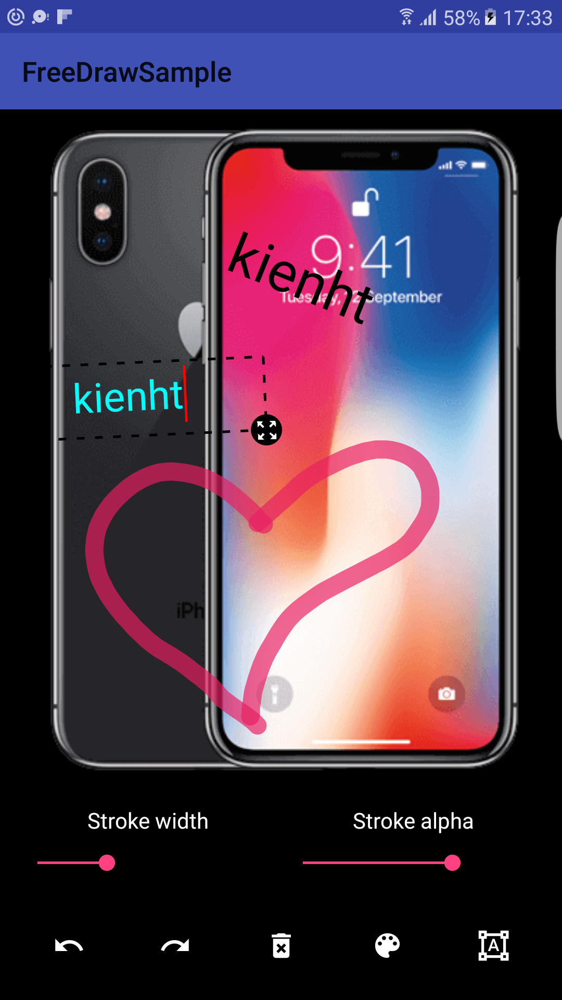

# Awesome-Input-Layout
Awesome Input Layout is an android library to display layout with multi EditText that can be rotated, autofit, zoom, delete within the app.

[](https://opensource.org/licenses/Apache-2.0)
[](http://developer.android.com/index.html)
[](https://jitpack.io/#hantrungkien/ImageDrawingView)

<a></a>

### install:

**via JitPack (to get current code)**

project/build.gradle
````gradle
allprojects {
    repositories {
        maven { url "https://jitpack.io" }
    }
}
````
module/build.gradle
````gradle
implementation 'com.github.hantrungkien:ImageDrawingView:1.0.0'
````

#### Feature

* Show image from Path or Drawable.
* Drawing tool (undo, redo).
* Bottom Sheet color picker.
* Input text sticker.

#### How to use please review in the demo app

#### Thanks

A special thanks go to the authors involved with these repositories, they were a great resource during our learning!

* https://github.com/RiccardoMoro/FreeDrawView

* https://github.com/wuapnjie/StickerView

### Contribution

If you've found an error, please file an issue.

Patches and new samples are encouraged, and may be submitted by forking this project and submitting a pull request through GitHub.


### LICENCE

    Copyright 2019 Kien Han Trung

    Licensed under the Apache License, Version 2.0 (the "License");
    you may not use this file except in compliance with the License.
    You may obtain a copy of the License at

       http://www.apache.org/licenses/LICENSE-2.0

    Unless required by applicable law or agreed to in writing, software
    distributed under the License is distributed on an "AS IS" BASIS,
    WITHOUT WARRANTIES OR CONDITIONS OF ANY KIND, either express or implied.
    See the License for the specific language governing permissions and
    limitations under the License.
